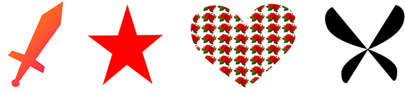

# pen-tool

English | [简体中文](./README-zh.md)

## Overview




This project is a canvas-based path drawing tool.
Background: In the h5 editors that are often encountered, there are always a variety of components, but most h5 editors have not found a satisfactory lightweight path drawing tool. So we decided to develop one according to the existing ideas. Considering the advantages of `typescript` over `javascript`, this project is built with `typescript`. If there are any imperfections or new features need to be added, please actively mention the issue.

### Directory
```
|-- pen-tool
    |-- lib                                 typescript declaration dir
    |   |-- constant.d.ts
    |   |-- cursorConfig.d.ts
    |   |-- penTool.d.ts
    |-- output                              typescript compiles outDir
    |   |-- constant.js
    |   |-- cursorConfig.js
    |   |-- penTool.js
    |-- src                                 source files
    |   |-- classes.ts
    |   |-- constant.ts
    |   |-- cursorConfig.ts
    |   |-- interface.ts
    |   |-- penTool.ts
    |-- static
    |   |-- demo.js
    |   |-- example.png
    |   |-- rose.png
    |-- demo.js                             js for demo
    |-- gulpfile.js
    |-- index.html                          index for demo
    |-- index.esm.js
    |-- index.umd.js
    |-- package-lock.json
    |-- package.json
    |-- README.md
    |-- README-zh.md
    |-- tsconfig.json
```

### Development
- compile
```
> tsc
```

- build
```
> gulp
```

### Usage
#### cdn 
```
...
<head>
    <script type="text/javascript" src="index.umd.js"></script>
</head>
<body>
    <button id="btn">EnablePen</button>
    <canvas id="canvas" width="600" height="400"></canvas>
</body>
...

<script>
    let pen = new PenTool("canvas");
    document.getElementById("btn").addEventListener("click", function() {
        pen.enablePen();
    })
</script>
```

#### npm 
```
npm install pen-tool
```

- index.html
```
<body>
    <button id="btn">EnablePen</button>
    <canvas id="canvas" width="600" height="400"></canvas>
</body>
```
- index.js
```
import PenTool from 'pen-tool'

let pen = new PenTool("canvas", {
    pathFillColor: 'red',
    isFillPath: true
    // ...
});
document.getElementById("btn").addEventListener("click", function() {
    pen.enablePen();
})
```

### Demo
Open `index.html` after starting server to see the demo. `index.html` and `demo.js` in the root directory are the example files.

### Parameters
In general, the curve is essential when drawing a path, but the Bezier curve drawn by hand cannot be in one step. In response to this problem, we give an adjustment handle to the curve, and control the drawing of the curve through the handle.

initial penTool
```
var pen = new Pen(canvasId, options);
```
- canvasId: `string` Canvas to draw the path. Make sure that the dom already exists when initializing
- options: `IPenOptions` optional
    - circle: `PenCircle` keyPoint configuration of path
      - radius: `number` keyPoint radius
      - stroke: `String | CanvasGradient | CanvasPattern` keyPoint circle strokeStyle
      - fill: `String | CanvasGradient | CanvasPattern` fillStyle
    - line: `PebLine` curve control auxLine configuration
      - stroke: `String | CanvasGradient | CanvasPattern`
      - fill: `String | CanvasGradient | CanvasPattern`
    - pathColor: `string` path strokeStyle
    - pathFillColor: `string` path fillStyle
    - isFillPath: `boolean` Whether fill the path. `false` for default

more information [`lib/penTool.d.ts`](./lib/penTool.d.ts)
  
#### Exit drawing
- Exit

    When the pen tool is turned on, press `ESC` for the first time to enter the path editing mode. At this time, you can modify the drawing shape by moving the key points of the path; press `ESC` for the second time or click the blank space in the path editing mode, Quit drawing.

- Edit

    If you want to re-edit the path after have exited drawing, just *double-click* the path area to enter the editing mode. For the determination of the path area, please refer to [isPointInPath](https://developer.mozilla.org/zh-CN/docs/Web/API/CanvasRenderingContext2D/isPointInPath)

#### Line-Curve
- Change path type

    In path editing mode: double-click the key point. If the current key point is a straight line type, the key point becomes a curve type. The straight line connecting the two key points before and after the current key point is a curve, and vice versa.

- Curve controller
  
    For the controllers of curve, moving the position of the handle can change the Bezier function of the curve, but the movement of the controller affects the path at both ends of the key points of the curve.
    Press the `Alt` key while moving the handle, you can only control the curve of the handle end.

### Future features
The current project is only a simple way to draw and edit paths, and it is not powerful. We will continue to improve in the future. Current goals:
- [ ] Support path to move in canvas
- [ ] Multi-path drawing


### License
[MIT License](./LICENSE)

  


